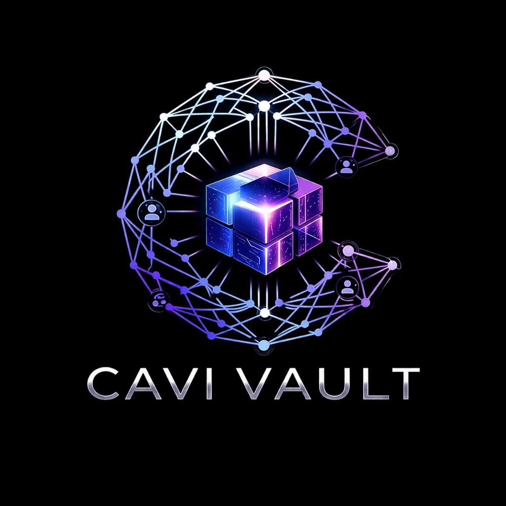

CAVI COLLECTIVE • Client Discovery Brief • Internal & Confidential

---

# CAVI COLLECTIVE

## Client Discovery Brief: Think Creative Agency

### Prospect Classification: SMB -- "Overwhelmed Operator"

### Discovery Date: April 15, 2026

**INTERNAL USE ONLY • CONFIDENTIAL**

---

# Table of Contents

| Section | Title | Focus |
|---------|-------|-------|
| **1** | **Executive Summary** | Company snapshot, velocity signals, opportunity assessment |
| **2** | **Velocity Qualification Scorecard** | 5-category qualification status against playbook framework |
| **3** | **Business Intelligence Deep Dive** | Company profile, workflow analysis, pain points, tech stack |
| **4** | **Mini Workflow Map** | Current-state vs. future-state with Cavi deployment |
| **5** | **Specialist Mapping** | Named agent assignments by phase with "Jeanette" reframe |
| **6** | **Tier Recommendation** | Three entry options with ROI comparison |
| **7** | **Objection Prep** | Diane's cost concern + 4 likely objections with talk tracks |
| **8** | **Account Growth Roadmap** | Division expansion plan with revenue trajectory |
| **9** | **Next Steps** | Dated action plan anchored to April 15, 2026 |
| **10** | **Follow-Up Questions** | 7 open items from the discovery call |
| **11** | **Internal Notes** | Founding customer candidacy, persona match, integration risk |

---

# 1. Executive Summary

---

## 1.1 Company Snapshot

| Field | Detail |
|-------|--------|
| **Company** | Think Creative Agency |
| **Industry** | Branding & Marketing Agency |
| **Years in Business** | 25 |
| **Revenue Range** | $2M -- $50M (SMB segment) |
| **Team Size** | ~20 creative staff (writers, designers, developers) + Partners |
| **Key Contacts** | Diane (Partner / Business Development), Kim (Account Manager), Lee (Account Manager) |
| **Tech Stack** | Teamwork (Core PM), Google Workspace (Gmail/Docs), Slack, Dropbox |
| **Primary Pain** | Partner-to-AM handoff breakdown; web builds drifting 50-100% past timeline |
| **Buyer Persona** | "The Overwhelmed Operator" (Playbook Section 2.2) |
| **Cavi Leadership Present** | Sean (Founder -- solution framing), Lamar (Executive Leadership -- technical intake) |

---

## 1.2 Critical Velocity Signal

> **"JEANETTE" -- THE STRONGEST BUYING SIGNAL IN THE PLAYBOOK**
>
> Think has independently conceptualized and **named** their ideal Cavi agent: "Jeanette" -- an imaginary project manager / admin assistant who "listens to everything" and handles all "repetitive, redundant work that does not take brainpower but takes a whole lot of time."
>
> Per Playbook Section 4.3, when a prospect **mentions a specific workflow**, that signals real pain. Think has gone far beyond that -- they have **designed the solution in their heads and given it a name.** This is an exceptionally strong buying signal. The prospect is not evaluating whether they need this -- they are evaluating whether Cavi can deliver what they have already imagined.
>
> **Closing lever:** Every conversation with Think should reference Jeanette by name. Show them that Cavi does not give them one Jeanette -- it gives them an entire coordinated team that IS Jeanette.

---

## 1.3 Opportunity Assessment

| Dimension | Assessment |
|-----------|------------|
| **Account Health** | Excellent. 25-year agency, stable revenue, desperate for a PM solution. |
| **Emotional Readiness** | High. They have conceptualized the solution themselves ("Jeanette"). |
| **Technical Fit** | Strong, with one flag. Teamwork integration needs engineering confirmation (see Section 3.5). |
| **Expansion Potential** | High. Think is a marketing agency -- natural expansion into Division 3 (Marketing & Brand) and Division 4 (AI Media Production). |
| **Risk** | They are wary of "AI science projects" that do not stick. The Teamwork integration must be seamless and must not require the creative team to learn a new UI. |

---

CAVI COLLECTIVE • Client Discovery Brief: Think Creative Agency • Internal & Confidential | www.cavivaultagents.io

---

# 2. Velocity Qualification Scorecard

Per Playbook Section 4.1, every discovery call must answer five qualification questions. Four out of five must be answered to move to solution and close.

---

| # | Category | Status | Evidence | Confidence |
|---|----------|--------|----------|------------|
| 1 | **PAIN** | CONFIRMED | Web builds drift from 20-week target to 30-40 weeks (50-100% overrun). Teamwork Workload Planner only 50% accurate due to manual estimates. Partner-to-AM handoff is the primary bottleneck. Kim and Lee are overwhelmed with manual administration. | 5/5 |
| 2 | **URGENCY** | NEEDS ASSESSMENT | Not explicitly stated in discovery call. Diane's active engagement and Think's 25-year struggle with timeline management suggest high latent urgency. **Probe on next call:** "What changes if you do not solve this in 30 days?" | 3/5 |
| 3 | **AUTHORITY** | PARTIALLY CONFIRMED | Diane is a Partner and led the conversation. Unclear whether other Partners must approve. **Probe on next call:** "Who else needs to nod for this to move?" | 4/5 |
| 4 | **BUDGET FIT** | UNKNOWN | Diane described AI PM work as "hard to bill for" -- this is NOT a rejection. She is thinking about how to justify the line item to clients. Budget question was not directly asked. **Critical probe on next call:** "Does a monthly subscription in the range of $2,800 to $3,400 fit your operating budget?" | 2/5 |
| 5 | **FIRST DELIVERABLE** | CONFIRMED | Automated project intake -- converting partner handoff notes into structured Client Briefs and Project Briefs in Teamwork/Google Docs, with linked Dropbox folder creation. They described the exact workflow unprompted. | 5/5 |

---

> **Qualification Status: ALMOST QUALIFIED (4 of 5)**
>
> PAIN and FIRST DELIVERABLE are locked. AUTHORITY is strong but needs confirmation. URGENCY is likely high but unconfirmed. **BUDGET FIT is the critical unknown** and must be the first question on the next call.
>
> Per Playbook Section 4.1: "Four of five = almost qualified. Address the missing one." The missing one here is BUDGET FIT. Address it directly -- do not wait.

---

CAVI COLLECTIVE • Client Discovery Brief: Think Creative Agency • Internal & Confidential | www.cavivaultagents.io

---

# 3. Business Intelligence Deep Dive

---

## 3.1 Company Profile

Think is a 25-year-old branding and marketing agency. Their longevity signals operational stability but also entrenched workflow patterns that are resistant to change. They have "never gotten it right" regarding timeline management -- meaning the pain has compounded over decades, and they are motivated to solve it.

**Team Structure:**

| Layer | People | Role |
|-------|--------|------|
| **Partners** | Diane + others | Business development, bring in client work |
| **Account Managers** | Kim, Lee (2 people -- the bottleneck) | Client management + manual project administration |
| **Creative Team** | ~20 (writers, designers, developers) | Execution layer |

**The Digital Marketing Exception:** Think's digital marketing team operates independently with repetitive tasks (e.g., ad optimization). The Cavi solution should focus primarily on the **Creative and Development workflows**, not digital marketing.

---

## 3.2 Pain Points (Ranked by Impact)

| Rank | Pain Point | Impact | Playbook Signal |
|------|-----------|--------|-----------------|
| **1** | **Partner-to-AM handoff breakdown** | Context lost at every project start. Kim and Lee spend hours reconstructing partner intent from informal notes. | "What is the work that is not getting done?" -- answered. |
| **2** | **Web build timeline drift** | 20-week target consistently drifts to 30-40 weeks. Every project overruns by 50-100%. | Direct revenue and capacity impact. |
| **3** | **Workload Planner 50% accurate** | Teamwork's Workload Planner relies on manual human estimates. Creative staff forget to assign time estimates to tasks. | Resource planning is broken at the input level. |
| **4** | **The Ripple Effect** | When a client misses a review deadline, the AMs cannot communicate the downstream consequence -- the project now clashes with three other projects in the pipeline. | Cross-project visibility gap. |
| **5** | **Client perception of stalled progress** | Clients feel nothing is happening during "deep work" phases even when the team is actively executing. | Transparency gap leads to client frustration. |

---

## 3.3 Competitive Context

> **GAP: This was not explored during the discovery call.**
>
> The following questions must be asked on the next call (per Playbook Section 4.2, Discovery Question Bank):
>
> - "What have you tried before to solve this? What worked and what did not?"
> - "Have you used AI tools before? ChatGPT, Claude, anything else? What was that experience like?"
> - "Are you evaluating other solutions right now?"
>
> The "Jeanette" concept suggests they have thought deeply about what they need but may not have evaluated competing solutions. If they mention general-purpose AI tools, use Objection #6 talk track: "Keep using them. Cavi is not a replacement for ChatGPT -- it is a replacement for the work you wish ChatGPT could do but cannot."

---

## 3.4 Tech Stack Analysis

| Tool | Category | Cavi Integration Path | Status |
|------|----------|----------------------|--------|
| **Teamwork** | Core PM | Division 6 (Project Ops) -- Board/Kanban Manager + Handoff & Recap Specialist integrate via Teamwork REST API | **NEEDS ENGINEERING CONFIRMATION** |
| **Google Workspace** | Productivity (Gmail, Docs) | Division 1 (Exec Ops) -- Chief Orchestrator routes via Google Workspace APIs | Supported (listed in Div 6 integrations) |
| **Slack** | Communications | Division 8 (Infrastructure) -- Channel Integration Specialist provides native Slack integration | Supported (listed in Div 1, 6, and 8 integrations) |
| **Dropbox** | File Storage | Division 8 (Infrastructure) -- System Extensions Lead manages file sync and folder creation via Dropbox API | **NEEDS ENGINEERING CONFIRMATION** |

> **INTEGRATION FLAG: Teamwork**
>
> Division 6 currently lists integrations as: GitHub Projects, Linear, Jira, Slack, Notion, Google Workspace. **Teamwork is not in the current integration list.** Teamwork has a well-documented REST API, and integration is achievable, but this must be confirmed with the engineering team before making commitments to Think.
>
> Per Playbook Section 1.5: Never promise a capability we have not confirmed. Say instead: "Teamwork has a robust API. We are confident we can integrate, and our engineering team will confirm the specifics during scoping."

---

CAVI COLLECTIVE • Client Discovery Brief: Think Creative Agency • Internal & Confidential | www.cavivaultagents.io

---

# 4. Mini Workflow Map

Per Playbook Section 3.3, the Free Workflow Assessment must deliver a Mini Workflow Map showing current bottlenecks and where Cavi specialists plug in.

---

## 4.1 Current State (As-Is)

| Step | Who / What | What Happens | Bottleneck |
|------|-----------|--------------|------------|
| **1. Deal Close** | Partners | Partner closes deal, creates informal handoff notes | -- |
| **2. Handoff** | Handoff Notes | Unstructured, varies by partner, context lost in translation | **#1: Context loss** -- critical information drops at every handoff |
| **3. Intake** | Kim or Lee (AMs) | Manual intake, data entry, project setup, time estimates, client updates | **#2: Capacity** -- 2 AMs for ~20 creatives. "Time-intensive and draining." |
| **4. Project Setup** | Teamwork | Workload Planner at 50% accuracy; manual task assignment; no cross-project visibility | **#3: Unreliable scheduling** -- creatives forget to add time estimates |
| **5. Execution** | Creative Team (~20) | Writers, designers, developers execute. Web builds: 30-40 weeks (target: 20) | **#4: Timeline drift** -- 50-100% overrun. No real-time client visibility. |

---

## 4.2 Future State (With Cavi -- "Jeanette" Realized)

| Step | Who / What | What Happens | Change from Today |
|------|-----------|--------------|-------------------|
| **1. Deal Close** | Partners | Partner closes deal, same as today | -- |
| **2. Intake** | Chief Orchestrator (Div 1) + Handoff & Recap Specialist + Memo & Brief Writer (Div 6) | Structured capture from call notes, transcripts, and partner input. Client Brief and Project Brief auto-generated. | **AUTOMATED** -- no context loss, no manual reconstruction |
| **3. Project Setup** | Project Ops Director + Board/Kanban Manager (Div 6) | Teamwork project created, tasks assigned, time estimates populated from historical data. Dropbox folder structure generated and linked. | **AUTOMATED** -- instant, accurate project scaffolding |
| **4. Review** | Kim & Lee (Human AMs) | Review and approve all outputs. Focus shifts to client relationships and strategic decisions. No more data entry. | **UPGRADED ROLE** -- human in the loop at every gate |
| **5. Transparency** | Comms Delivery + Data Viz Lead + Deck Specialist (Div 6) | Weekly client "nudge" emails: "We are 75% done with X; the team completed 12 tasks this week." Real-time dashboards. | **AUTOMATED** -- clients see progress without asking |
| **6. Execution** | Creative Team (~20 people) | Clear briefs from day one. Accurate scheduling. Cross-project conflict detection when milestones slip. | **TARGET** -- web builds back to 20 weeks |

---

CAVI COLLECTIVE • Client Discovery Brief: Think Creative Agency • Internal & Confidential | www.cavivaultagents.io

---

# 5. Specialist Mapping

Each phase maps to named agents from the Cavi roster. All agent IDs reference `src/data/agents.ts`.

---

## 5.1 Phase 1: Automated Intake & Setup (5 Agents)

The first proof point -- automating the Brief to Teamwork Project to Dropbox Folder chain.

| Agent | ID | Division | Role at Think |
|-------|----|----------|---------------|
| **Chief Orchestrator** | exec-1 | Executive Ops (Div 1) | Central intake: receives partner handoff notes, structures requirements, routes to Project Ops |
| **Project Ops Director** | ops-1 | Project Ops (Div 6) | Cross-team project coordination, reporting to Kim and Lee |
| **Board/Kanban Manager** | ops-2 | Project Ops (Div 6) | Creates and manages Teamwork boards, enforces task hygiene, populates Workload Planner |
| **Memo & Brief Writer** | ops-4 | Project Ops (Div 6) | Generates Client Briefs and Project Briefs from intake data |
| **Handoff & Recap Specialist** | ops-7 | Project Ops (Div 6) | Produces structured handoff bundles from partner notes and meeting transcripts |

---

## 5.2 Phase 2: Intelligent Scheduling (4 Agents)

Predictive time estimates and cross-project conflict resolution.

| Agent | ID | Division | Role at Think |
|-------|----|----------|---------------|
| **Data Visualization Lead** | ops-6 | Project Ops (Div 6) | Workload dashboards, capacity visualization, schedule accuracy tracking |
| **Comms Delivery Specialist** | ops-5 | Project Ops (Div 6) | Automated Slack and email updates to internal team and clients |
| **Channel Integration Specialist** | infra-2 | Infrastructure (Div 8) | Slack + Teamwork + Google Workspace integration layer (ECG) |
| **System Extensions Lead** | infra-4 | Infrastructure (Div 8) | Cron jobs for scheduled status pulls, Dropbox sync, automated folder creation |

---

## 5.3 Phase 3: Automated Transparency (3 Agents)

Weekly client "nudge" reports and real-time project visibility.

| Agent | ID | Division | Role at Think |
|-------|----|----------|---------------|
| **Deck & Presentation Specialist** | ops-3 | Project Ops (Div 6) | Client-facing project status reports, automated weekly summaries |
| **Infrastructure Lead** | infra-1 | Infrastructure (Div 8) | Platform health, monitoring, reliability of all integrations |
| **Session & Memory Ops Specialist** | infra-3 | Infrastructure (Div 8) | Session state management, context retention across projects and conversations |

---

## 5.4 The "Jeanette" Reframe

Think described Jeanette as one imaginary person. Cavi delivers something better -- a coordinated team.

> **Talk Track:**
>
> "You described Jeanette -- your ideal AI project manager who captures partner context, builds accurate schedules, and keeps clients informed. What we have built is exactly that, except instead of one Jeanette, you get a coordinated team of specialists: a Chief Orchestrator for intake, a Board Manager for scheduling, a Comms Specialist for transparency, and a Data Viz Lead for dashboards. Jeanette is not one agent -- she is a division working in concert. And unlike one person, this team runs 24/7, never takes vacation, and scales with your agency."

| "Jeanette" Capability | Cavi Specialist | How It Works |
|----------------------|-----------------|-------------|
| "Listens to everything" | Chief Orchestrator + Handoff & Recap Specialist | Ingests call transcripts, partner notes, and meeting recordings. Structures into briefs. |
| "Handles repetitive work" | Board/Kanban Manager + Memo & Brief Writer | Auto-creates Teamwork projects, populates tasks, generates documentation. |
| "Keeps clients informed" | Comms Delivery Specialist + Deck & Presentation Specialist | Weekly "nudge" emails with progress metrics. Auto-generated status decks. |
| "Fixes the schedule" | Data Visualization Lead + Project Ops Director | Predictive estimates from historical data. Cross-project conflict detection when milestones slip. |

---

CAVI COLLECTIVE • Client Discovery Brief: Think Creative Agency • Internal & Confidential | www.cavivaultagents.io

---

# 6. Tier Recommendation

---

## 6.1 Recommended Entry Path

Two options at different commitment levels. Option A is recommended.

| Option | Tier | Specialists | Monthly Cost | What Think Gets |
|--------|------|-------------|-------------|-----------------|
| **A (Recommended)** | Project Operations | 7 (all Div 6) + Chief Orchestrator (Div 1) + Div 8 infra support | $3,400/mo | Full "Jeanette" realization across all 3 phases. All 7 Project Ops agents + integration support. $500 setup fee (waivable by Executive sign-off). |
| **B (Lower commitment)** | Starter Team | 3 specialists | $2,800/mo | Phase 1 only: Chief Orchestrator + Board/Kanban Manager + Handoff & Recap Specialist. 14-day free trial, no card required. Expand after proving value. |

---

## 6.2 ROI Comparison

> **The Anchoring Move (Playbook Section 5.4):**
>
> "What does it cost you to hire one project manager for this role? At Think's level, that is $70,000 to $90,000 per year loaded -- $5,800 to $7,500 per month. The full Project Operations division -- seven specialists running 24/7 -- is $3,400 per month. Less than half the cost of one hire, and it deploys in days, not the 90 days it takes to find and onboard a PM."

| Metric | Current Cost (Without Cavi) | With Cavi (Option A) |
|--------|---------------------------|---------------------|
| PM labor cost | $5,800 - $7,500/mo (one loaded PM hire) | $3,400/mo (7 specialists) |
| Setup | Recruiting fees, onboarding, ramp time | $500 one-time (waivable by Executive sign-off) |
| Kim & Lee admin time | ~30 hrs/week combined on manual PM admin | Projected: 5-10 hrs/week (review and approve only) |
| Web build overrun cost | 10-20 extra weeks per project at agency burn rate | Target: back to 20-week template |
| Workload Planner accuracy | 50% (manual estimates) | Projected: significantly improved via historical data and auto-population |

---

## 6.3 Close Script

> **If Think is ready (Option A):**
>
> "Based on what you described, the full Project Operations division is the right fit. Seven specialists, deployed in days, with Kim and Lee reviewing everything. $3,400 per month -- less than half the cost of one PM hire. Can we get started this week?"

> **If Think needs a lower commitment first (Option B):**
>
> "Let us start with three specialists on the intake workflow. $2,800 per month, 14 days free, no card required. You will see live output on a real project handoff before you pay anything. If it works, we expand to the full division."

---

CAVI COLLECTIVE • Client Discovery Brief: Think Creative Agency • Internal & Confidential | www.cavivaultagents.io

---

# 7. Objection Prep

---

## 7.1 Diane's "Hard to Bill For" Concern

**The objection:** Diane described AI project management as "hard to bill for." She is thinking about this as a line item she needs to pass through to clients, and she is struggling to justify it.

**What she is really asking:** "How do I make this pay for itself?" This is NOT "this is too expensive." She is looking for the value frame.

> **Primary Reframe (Capacity, Not Cost):**
>
> "You do not bill for Jeanette the way you bill for a designer's hours. You bill for the result: web builds delivered in 20 weeks instead of 40. Right now, those extra 10-20 weeks cost you -- in delayed revenue, in client frustration, in Kim and Lee's overtime. If Cavi cuts your web build cycle in half, what is that worth per project? That is the number."

> **Secondary Reframe (Playbook Secondary Value Statement):**
>
> "Coordinated AI specialists working under your team's direction -- building capacity, freeing budget, and creating workflows that compound over time."
>
> Frame the $3,400/month against the cost of timeline drift: if even one web build per quarter comes in 10 weeks faster, the retained revenue and reduced overhead likely exceeds the entire annual Cavi subscription.

> **ROI Math (Playbook Objection #12):**
>
> Conservative estimate: if Cavi saves Kim and Lee 15 hours per week each (30 hours total) at a blended rate of $50/hour, that is **$6,000/month in labor offset** against **$3,400/month in subscription cost.** Net savings: $2,600/month -- before accounting for the strategic value of Kim and Lee focusing on client relationships instead of data entry.

---

## 7.2 Additional Objections to Prepare For

| Likely Objection | Playbook Reference | Preparation |
|-----------------|-------------------|-------------|
| "We tried AI before and it did not work." | Objection #8 | "Most AI tools fail because they are general-purpose. Cavi is the opposite. Each specialist has a narrow scope, specific guardrails, and human approval gates. The pilot exists specifically so you can see it working on your workflows." |
| "AI is not reliable enough for real work." | Objection #3 | "You are right that raw AI is not reliable enough. That is exactly why Cavi exists. We give you specialists with narrow scopes, specific guardrails, and human approval gates at every output stage. Nothing ships without Kim and Lee's review." |
| "My team will resist this." | Objection #11 | "Cavi gives Kim and Lee superpowers. They are not being replaced -- they are being amplified. The specialists handle the repetitive, time-consuming admin work. Kim and Lee focus on the strategic, relationship-driven work that only humans can do." |
| "You are a new company. Why should I trust you?" | Objection #1 | "The founders are in the room. You get founder-level attention, direct access to the team building the platform, and a real seat at the table on what we build next. The pilot exists specifically so you can see it working before you commit." |

---

CAVI COLLECTIVE • Client Discovery Brief: Think Creative Agency • Internal & Confidential | www.cavivaultagents.io

---

# 8. Account Growth Roadmap

---

## 8.1 Phase Map

| Timeline | Division(s) | Monthly Cost | Rationale |
|----------|------------|-------------|-----------|
| **Month 1-3: Foundation** | Division 6: Project Ops (7 agents) + Division 1: Exec Ops (1 agent, routing) + Division 8: Infrastructure (select agents) | $3,400/mo | Solve the core pain. Deploy "Jeanette." Prove value on web build timelines. |
| **Month 4-6: Marketing Support** | Add Division 3: Marketing & Brand (25 agents, 5 departments) | $9,265/mo (2-dept 15% discount) | Think IS a marketing agency. Their own lead generation, content production, and brand work can benefit from Cavi specialists. |
| **Month 6-12: Media Production** | Add Division 4: AI Media Production (5 agents) | $10,960/mo (3-dept 20% discount) | Think could offer AI-enhanced media production to their clients as a differentiated service. |
| **Year 2: Full Platform** | Add Division 2: Engineering & Dev (15 agents) + Division 7: Research & Intelligence (4 agents) | $15,000+/mo (4+ dept 25% discount) | Transform Think's core deliverable -- web builds. 15 engineering specialists could dramatically expand build capacity. |

**Multi-Department Discount Schedule:**

| Departments | Standard Discount | Notes |
|------------|-------------------|-------|
| 2 departments | 15% off combined monthly | Standard |
| 3 departments | 20% off combined monthly | Standard |
| 4+ departments | 25% off combined monthly | Deeper discounts available if price is a barrier -- Executive approval required |

---

## 8.2 Revenue Trajectory

| Stage | Monthly Revenue | Annual Revenue |
|-------|----------------|---------------|
| Entry (Project Ops only) | $3,400 | $40,800 |
| Expanded (+ Marketing) | $9,265 | $111,180 |
| Full (+ Media) | $10,960 | $131,520 |
| Platform (+ Engineering + Research) | $15,000+ | $180,000+ |

> **Leadership Takeaway (from discovery call):**
>
> This is a "bread and butter" SMB deal. If we solve the "Jeanette" PM bottleneck, we have a long-term partner who will eventually expand into Division 3 (Marketing & Brand) and Division 4 (AI Media Production). The expansion path is natural because Think's business IS marketing and media.

---

CAVI COLLECTIVE • Client Discovery Brief: Think Creative Agency • Internal & Confidential | www.cavivaultagents.io

---

# 9. Next Steps

All dates anchored to April 15, 2026 (today).

---

| Step | Date | Owner | Action |
|------|------|-------|--------|
| 1 | **April 16, 2026 (Wed)** | AE (Lamar) | Send Think this Mini Workflow Map + Specialist Recommendation via email. Use Playbook Template 8.9 (Follow-Up After Free Workflow Assessment). |
| 2 | **April 17, 2026 (Thu)** | AE + Diane | Decision conversation. Present tier recommendation. Answer the two critical qualification gaps: BUDGET FIT and URGENCY. |
| 3 | **April 18, 2026 (Fri)** | AE | Redo pitch deck to focus on "Web Build 20-week compression" and "Jeanette" as a shared resource for Kim and Lee. If yes: send agreement for Project Ops or Starter Team tier. |
| 4 | **April 21, 2026 (Mon)** | Delivery | Onboarding Day 1: Onboarding call, Teamwork API configuration, Slack integration setup. |
| 5 | **April 22, 2026 (Tue)** | Delivery | Onboarding Day 2: Chief Orchestrator + Board/Kanban Manager deployed. Test with a real partner handoff. |
| 6 | **April 23, 2026 (Wed)** | Delivery | Onboarding Day 3: First live output reviewed by Kim and Lee. "Jeanette" is alive. |
| 7 | **April 30, 2026 (Wed)** | AE | Week 1 check-in: review output, address issues, discuss Phase 2 expansion. |
| 8 | **May 15, 2026 (Thu)** | AE | 30-day review: present results with Think's own numbers. If on Starter Team, propose full Project Ops division. |

---

> **14-Day Rule Check (Playbook Section 3.1):**
>
> Decision conversation on April 17. If not closed by **April 29 (Day 12)**, trigger the direct ask: "We are at Day 12. What is the one thing that needs to happen for you to say yes or no?"

---

CAVI COLLECTIVE • Client Discovery Brief: Think Creative Agency • Internal & Confidential | www.cavivaultagents.io

---

# 10. Follow-Up Questions

Seven open items from the discovery call that must be addressed in the next conversation.

---

| # | Category | Question | Why It Matters |
|---|----------|----------|----------------|
| 1 | **URGENCY** | "What changes if you do not solve this in 30 days?" | Qualifies urgency. Is there a specific deadline, a client at risk, or a seasonal trigger? |
| 2 | **BUDGET FIT** | "Does a monthly subscription in the range of $2,800 to $3,400 fit your operating budget?" | Critical qualification gap. Must be asked directly. |
| 3 | **AUTHORITY** | "Who else besides you needs to approve this? Do your other partners need to be involved?" | Confirms whether Diane is the sole decision maker. |
| 4 | **COMPETITIVE CONTEXT** | "What have you tried before to solve this? What worked and what did not?" | Understand prior solutions and why they failed. |
| 5 | **AI EXPERIENCE** | "Have you used AI tools before -- ChatGPT, Claude, anything else? What was that experience like?" | Calibrate expectations and address potential skepticism. |
| 6 | **TEAM RECEPTION** | "How do you think Kim and Lee would react to having an AI assistant handling intake and scheduling?" | Probes Objection #11 (team resistance) early. |
| 7 | **VOLUME DATA** | "How many new projects do you kick off per month? What is the average project value?" | Needed for precise ROI calculation. |

---

CAVI COLLECTIVE • Client Discovery Brief: Think Creative Agency • Internal & Confidential | www.cavivaultagents.io

---

# 11. Internal Notes

---

## 11.1 Founding Customer Candidacy

**Assessment: STRONG CANDIDATE**

| Criterion | Evidence |
|-----------|----------|
| Stability | 25-year agency -- credible, established, not a flight risk. |
| Articulable pain | They can describe the problem in their own words, with specifics (20-week target, 50% accurate planner, "Jeanette"). |
| Engaged partnership | The "Jeanette" concept means they will be active collaborators, not passive users. |
| Referral potential | As a marketing agency, Think talks to other agencies and brands constantly. A successful deployment becomes a case study and a referral source. |
| Case study value | "25-year agency solves the PM bottleneck they have struggled with for decades" -- powerful narrative. |

> **Founding Customer Pitch (Playbook Section 9.11):**
>
> "Based on your vision for Jeanette and your 25 years in the industry, Think is exactly the kind of founding partner we are looking for. You get founder-level attention, direct access to the team building the platform, and a real seat at the table on what we build next."

---

## 11.2 Persona Match Confirmation

Think matches the **"Overwhelmed Operator" (SMB)** persona from Playbook Section 2.2:

- "I need more output but I cannot hire fast enough" -- Kim and Lee are overwhelmed
- "My team is doing work that should not require senior people" -- AMs doing data entry instead of client strategy
- Growing fast, team is stretched -- 20 creatives served by 2 AMs
- Founders still in the room -- Diane is a Partner and active decision participant

---

## 11.3 Integration Risk Register

| Risk | Severity | Mitigation |
|------|----------|-----------|
| **Teamwork not in current integration list** | Medium | Confirm Teamwork REST API integration with engineering team before the decision call (April 17). Teamwork has a well-documented API -- achievable but unconfirmed. |
| **Dropbox folder automation** | Low | System Extensions Lead (infra-4) handles cron jobs and automation. Dropbox API is well-documented. Lower risk than Teamwork. |
| **Creative team adoption resistance** | Medium | Frame as "superpowers for Kim and Lee" -- not a new tool the creative team needs to learn. Cavi works inside Teamwork, Slack, and Google Docs (their existing tools). No new UI. |
| **"AI science project" skepticism** | High | Diane's top concern. The pilot must produce tangible, reviewable output within 3 days. No demos, no mockups -- real work on a real project handoff. |

---

CAVI COLLECTIVE • Client Discovery Brief: Think Creative Agency • Internal & Confidential | www.cavivaultagents.io

---

## Division Deployment Summary

| Division | Role in Think Deployment | Agents Deployed | Phase |
|----------|------------------------|-----------------|-------|
| **Division 1: Executive Operations** | Central intake -- converting partner handoff notes into structured briefs | 1 (Chief Orchestrator) | Phase 1 |
| **Division 6: Project Operations** | Lead division. Teamwork sync, Gantt/board hygiene, "Jeanette" status reports, workload planning | 7 (full division) | Phases 1-3 |
| **Division 8: Infrastructure & Reliability** | External Connector Gateway (ECG) -- secure 24/7 Slack, Teamwork, Dropbox, and Google Workspace routing | 4 (full division) | Phases 2-3 |

**Total agents for initial deployment: 12 across 3 divisions.**

---

**CAVI COLLECTIVE**

Client Discovery Brief: Think Creative Agency

Internal & Confidential

---

**Prepared:** April 15, 2026

**Classification:** SMB -- "Overwhelmed Operator"

**Qualification Status:** Almost Qualified (4/5) -- BUDGET FIT pending

**Recommended Tier:** Project Operations ($3,400/mo)

**Account Potential:** $3,400/mo entry to $15,000+/mo full platform

---

**www.cavivaultagents.io**

*66+ agents across 8 divisions -- and growing.*

---

CAVI COLLECTIVE • Client Discovery Brief: Think Creative Agency • Internal & Confidential | www.cavivaultagents.io
